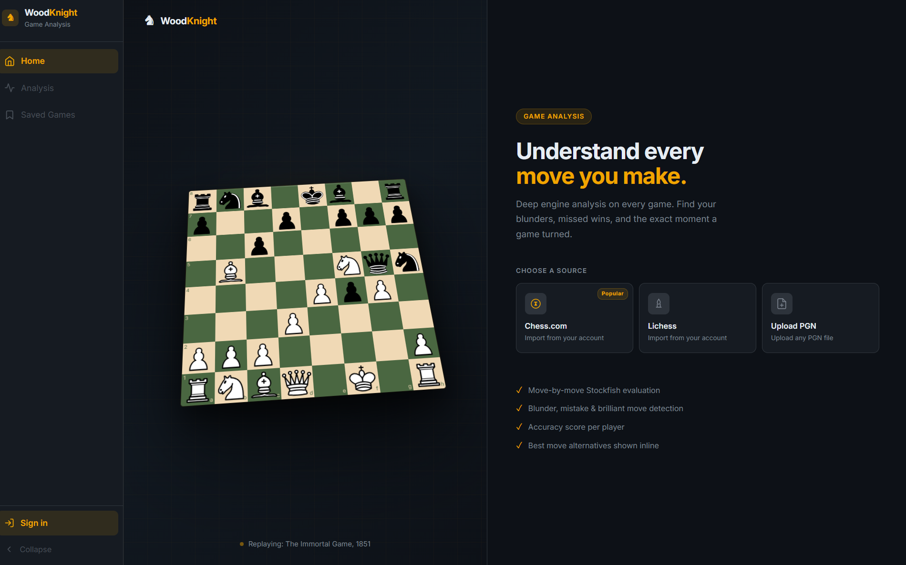
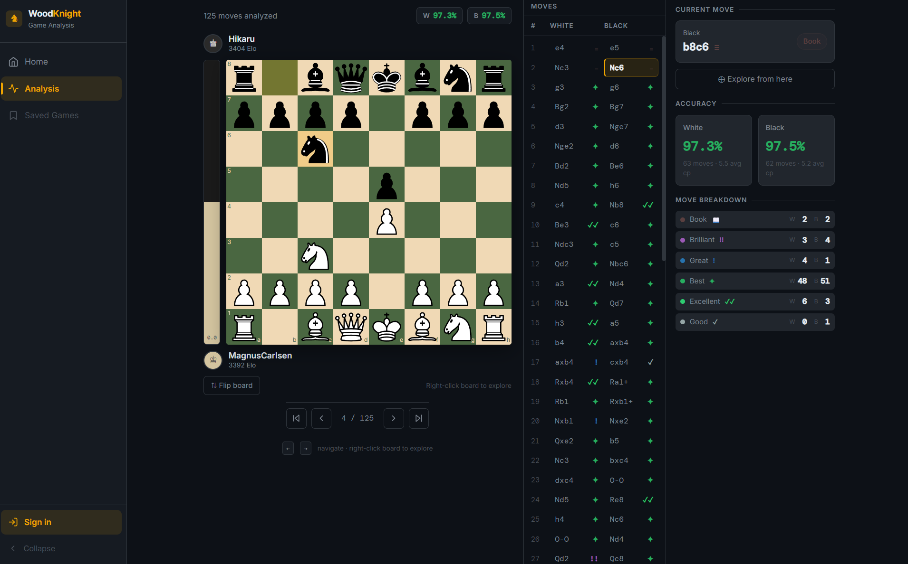
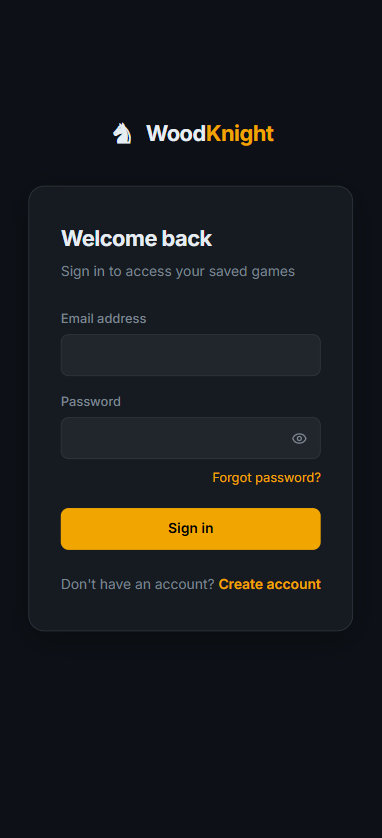
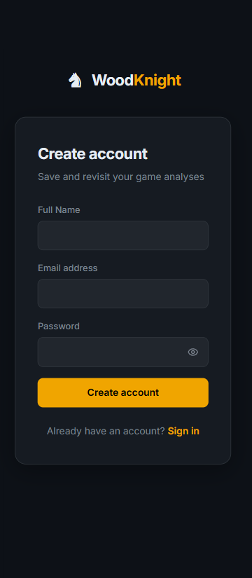
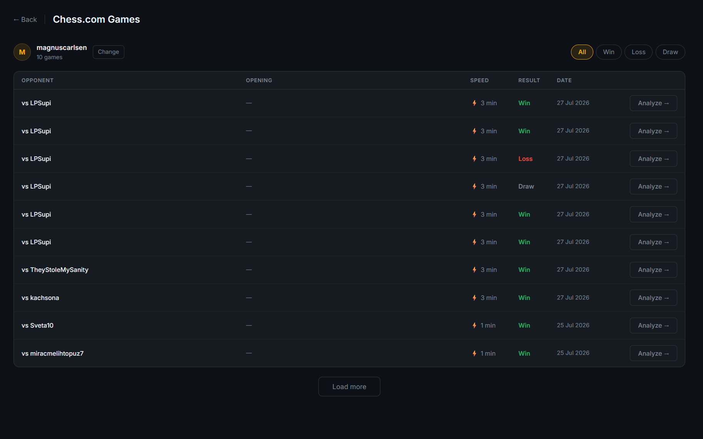

# ♞ Wood Knight

>chess game analysis platform. Review your games, find your mistakes, and improve your play — with deep Stockfish engine analysis, move-by-move evaluation, and a beautiful interactive analysis board.

---

## Screenshots


| Home | Analysis Board |
|------|----------------|
|  |  |

| Login | Sign Up |
|-------------|--------|
|  |  |

| Game Browser |
|--------------------|
|  |


---

## Features

**Analysis**
- Upload any PGN file for instant Stockfish analysis
- Import games directly from Chess.com or Lichess by username
- Move-by-move engine evaluation with centipawn loss
- Move classification — Brilliant, Best, Great, Excellent, Good, Inaccuracy, Mistake, Blunder, Miss
- Win probability tracking across the full game
- Top 3 engine alternatives per move
- Opening book detection via Polyglot format

**Analysis Board**
- Interactive board synced to move list
- Eval bar always from White's perspective
- Classification badge on destination square after each move
- Move explorer — right-click the board or click any top alternative to freely explore from any position
- Keyboard navigation with arrow keys
- Flip board
- Player names and Elo displayed above and below the board

**Platform Integration**
- Browse and filter Chess.com and Lichess games by result and time control
- One-click analysis from the game list
- Paginated game history

**Accounts & Saved Games**
- Email/password authentication with email verification
- Forgot password flow
- Save analyzed games to your account — no need to re-analyze
- Reload any saved game instantly
- Row-level security — users can only access their own data

**UI**
- Navy + Amber dark theme with CSS token system built for future theme switching
- Fully responsive — Desktop, Tablet, Mobile
- Collapsible sidebar with hamburger drawer on mobile
- Animated 3D hero board replaying the Immortal Game (Anderssen vs Kieseritzky, 1851)

---

## Project Flow

This is the end-to-end journey a user takes through Wood Knight — from landing on the app to reviewing a fully analyzed game.

```
┌─────────────────────────────────────────────────────────────────────┐
│                          USER JOURNEY                               │
└─────────────────────────────────────────────────────────────────────┘

  1. LANDING
     User arrives at the home page
     Animated 3D board plays the Immortal Game in the background
          │
          ▼
  2. CHOOSE A SOURCE
     ┌──────────────┬──────────────┬──────────────┐
     │  Chess.com   │   Lichess    │  Upload PGN  │
     └──────┬───────┴──────┬───────┴──────┬───────┘
            │              │              │
            ▼              ▼              │
  3. BROWSE GAMES          │              │
     Enter username        │              │
     Backend fetches       │              │
     game list from        │              │
     platform API          │              │
     Filter by result      │              │
     or time control       │              │
     Pick a game ──────────┘              │
            │                             │
            ▼                             ▼
  4. ANALYSIS REQUEST
     Frontend sends game to backend
     ┌─────────────────────────────────┐
     │  POST /analyze                  │
     │  POST /analyze/chesscom         │
     │  POST /analyze/lichess          │
     └────────────────┬────────────────┘
                      │
                      ▼
  5. ENGINE ANALYSIS  (backend)
     Parse PGN → positions
     For each position:
       → Stockfish Multi-PV evaluation
       → Centipawn loss calculation
       → Win probability delta
       → Opening book lookup
       → Move classification
     Aggregate player accuracy stats
     Return structured JSON
                      │
                      ▼
  6. ANALYSIS BOARD   (frontend)
     Board renders current position
     Eval bar updates after each move
     Move list shows all moves with symbols
     Classification badge flashes on board
     Stats panel shows accuracy + alternatives
          │
          ├── Navigate moves (click / arrow keys)
          ├── Explore alternatives (right-click board)
          └── View top engine moves in stats panel
                      │
                      ▼
  7. SAVE (optional, requires account)
     Save game modal appears automatically
     User clicks Save → stored in Supabase
     Full analysis JSON preserved
          │
          ▼
  8. SAVED GAMES
     User returns later
     Opens Saved Games from sidebar
     Clicks any game → analysis reloads instantly
     No re-analysis needed
```

---

## Authentication Flow

```
  SIGN UP                          SIGN IN
     │                                │
     ▼                                ▼
  Enter email + password         Enter email + password
  Password strength check        POST to Supabase Auth
  POST to Supabase Auth               │
     │                           ┌────┴─────┐
     ▼                           │          │
  Verification email sent      Success    Failure
     │                           │          │
     ▼                           ▼          ▼
  User clicks link            JWT token  Error shown
     │                        stored in   to user
     ▼                        session
  Account activated               │
     │                            ▼
     └──────────────────► App unlocks:
                           - Save games
                           - Saved games page
                           - User shown in sidebar

  FORGOT PASSWORD
     │
     ▼
  Enter email
  Supabase sends reset link
  User clicks link → sets new password
  Redirected to login
```

---


```
┌─────────────────────────────────────────────────────────────────┐
│                        Client (Browser)                         │
│                                                                 │
│   React Frontend  ──── Supabase JS Client ────► Supabase        │
│        │                                        (Auth + DB)     │
│        │ fetch                                                  │
│        ▼                                                        │
│   FastAPI Backend ──── Stockfish Engine                         │
│        │                                                        │
│        ├── Chess.com API                                        │
│        └── Lichess API                                          │
└─────────────────────────────────────────────────────────────────┘
```

**Key design decisions:**
- Authentication is fully delegated to Supabase — the backend never handles passwords or tokens directly
- The Stockfish engine is kept as a singleton with an LRU cache and thread lock so concurrent requests don't spin up multiple engine instances
- The frontend never stores sensitive credentials — only a public anon key scoped by Row Level Security policies
- Platform game fetching (Chess.com, Lichess) happens server-side so API rate limits and CORS restrictions are handled in one place

---

## Low Level Design (LLD)

### Analysis Pipeline

```
PGN Input
    │
    ▼
pgn_handler.py          Parse PGN into a list of moves and positions
    │
    ▼
stockfish_engine.py     Singleton engine wrapper
    │                   - LRU cache keyed by FEN
    │                   - Thread lock for concurrent safety
    │                   - Multi-PV mode: returns top N moves per position
    ▼
analyzer.py             For each move:
    │                   1. Get eval BEFORE the move (from mover's perspective)
    │                   2. Play the move on the board
    │                   3. Get eval AFTER the move
    │                   4. Calculate centipawn loss = max(0, eval_before - eval_after)
    │                   5. Convert evals to win probability via sigmoid
    │                   6. Check opening book (Polyglot lookup)
    ▼
classifier.py           Classify move quality:
    │                   - Book      → in opening book
    │                   - Brilliant → best move + involves material sacrifice
    │                   - Best      → matches engine top choice exactly
    │                   - Great     
    │                   - Excellent 
    │                   - Good      
    │                   - Inaccuracy
    │                   - Mistake   
    │                   - Blunder   
    │                   - Miss      → missed a forced mate or decisive advantage
    ▼
service.py              Aggregate per-player stats:
    │                   - Count of each classification label
    │                   - Average centipawn loss
    │                   - Average win probability loss
    │                   - Overall accuracy (weighted formula)
    ▼
JSON Response           Returned to frontend via POST /analyze
```

### Frontend State Flow

```
PGN / Platform Game
        │
        ▼
  POST /analyze  ──────────────────────► analysis JSON
        │                                      │
        ▼                                      ▼
  useGameStore                         chess.js replays PGN
  (analysis, pgnText, players)         → FEN per move index
        │
        ├── currentMoveIndex (shared state)
        │         │
        │    ┌────┴─────────────────────────┐
        │    ▼                              ▼
        │  Board.jsx                  MoveList.jsx
        │  (FEN from index)           (highlight active row)
        │    │
        │    ├── EvalBar.jsx          StatsPanel.jsx
        │    └── ClassificationBadge (top alternatives, accuracy)
        │
        └── useMoveExplorer
             (branch off current FEN, explore freely)
```

### Database Schema

```
auth.users  (managed by Supabase)
    │
    └──► analyzed_games
            id           uuid  PK
            user_id      uuid  FK → auth.users
            white        text
            black        text
            analysis     jsonb   (full /analyze response)
            pgn_text     text
            created_at   timestamptz
```

Row Level Security ensures every query is automatically scoped to the authenticated user — no user ID filtering needed in application code.

---

## Tech Stack

### Backend
| Layer | Technology |
|---|---|
| Language | Python 3.14 |
| Framework | FastAPI |
| Chess Engine | Stockfish via python-chess |
| Multi-PV Analysis | Stockfish Multi-PV mode |
| Opening Book | Polyglot format |
| Data Validation | Pydantic v2 |
| Server | Uvicorn |

### Frontend
| Layer | Technology |
|---|---|
| Framework | React 18 + Vite |
| State Management | Zustand |
| Chess Logic | chess.js |
| Board Rendering | react-chessboard |
| Auth + Database | Supabase |
| Styling | Tailwind CSS v4 + CSS custom properties |
| Icons | Lucide React |

---

## Project Structure

```
wood-knight/
├── backend/
│   ├── api/
│   │   └── routes.py
│   ├── analysis/
│   │   ├── analyzer.py
│   │   ├── classifier.py
│   │   ├── exchange.py
│   │   ├── service.py
│   │   └── models.py
│   ├── data/
│   │   └── gm2001.bin
│   ├── engine/
│   │   └── stockfish_engine.py
│   ├── game/
│   │   └── pgn_handler.py
│   ├── platforms/
│   │   ├── base.py
│   │   ├── chesscom.py
│   │   └── lichess.py
│   └── requirements.txt
│
└── frontend/
    ├── src/
    │   ├── api/
    │   │   ├── analyzeGame.js
    │   │   └── savedGames.js
    │   ├── components/
    │   │   ├── analysis/
    │   │   │   ├── Board.jsx
    │   │   │   ├── EvalBar.jsx
    │   │   │   ├── MoveList.jsx
    │   │   │   ├── NavigationControls.jsx
    │   │   │   └── StatsPanel.jsx
    │   │   ├── auth/
    │   │   │   ├── AuthComponents.jsx
    │   │   │   └── SaveGameModal.jsx
    │   │   ├── home/
    │   │   │   └── HeroBoard.jsx
    │   │   └── layout/
    │   │       ├── MobileNavbar.jsx
    │   │       └── Sidebar.jsx
    │   ├── constants/
    │   │   └── theme.js
    │   ├── hooks/
    │   │   ├── useBreakpoint.js
    │   │   ├── useClassificationBadge.js
    │   │   ├── useKeyboardNav.js
    │   │   └── useMoveExplorer.js
    │   ├── lib/
    │   │   ├── chessHelpers.js
    │   │   └── supabase.js
    │   ├── pages/
    │   │   ├── AnalysisPage.jsx
    │   │   ├── ForgotPasswordPage.jsx
    │   │   ├── GameBrowserPage.jsx
    │   │   ├── HomePage.jsx
    │   │   ├── LoginPage.jsx
    │   │   ├── SavedGamesPage.jsx
    │   │   └── SignupPage.jsx
    │   └── store/
    │       ├── useAuthStore.js
    │       └── useGameStore.js
    └── package.json
```

---

## Move Classification

| Label | Symbol | Meaning |
|-------|--------|---------|
| Book |`📖` | Opening theory move |
| Brilliant | `!!` | Best move involving a sacrifice |
| Best | `✦` | Engine's top choice |
| Great | `!` | Virtually optimal |
| Excellent |`✓✓` | Very accurate |
| Good |`✓` | Solid move |
| Inaccuracy | `?!` | Slight inaccuracy |
| Mistake | `?` | Significant mistake |
| Blunder | `??` | Serious blunder |
| Miss |`⊘` | Missed winning opportunity |

---

## Planned

- Google OAuth login
- Play vs Stockfish with selectable difficulty by Elo rating
- Pass and Play local two-player mode
- Chess clock for timed games
- User-selectable color themes
- Opening explorer
- Performance insights dashboard
- Better brilliant move detection

---

## License

MIT
